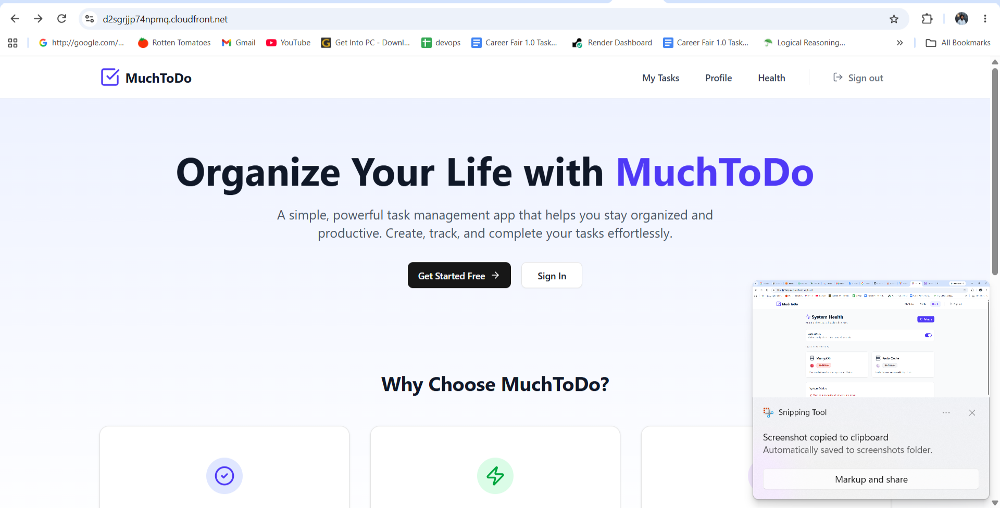

# StartTech Enterprise DevOps Platform

An end-to-end production style DevOps project demonstrating how to deploy, automate, and manage a full-stack application on Amazon Web Services using modern Infrastructure as Code (IaC), containerization, Kubernetes, and CI/CD.

This project was built as a real world simulation of how a Cloud/DevOps Engineer would provision infrastructure, deploy applications, and automate delivery in an enterprise environment.

## Live Application

The application is deployed on Amazon EKS behind an AWS Application Load Balancer.



## Project Architecture

The platform consists of two major components:

```
.
├── starttech-infra/
│   ├── terraform/
│   └── README.md
│
├── starttech-application/
│   ├── kubernetes/
│   ├── frontend/
│   ├── backend/
│   ├── .github/
│   └── README.md
│
└── README.md
```

---

# Repository Structure

## 1. starttech-infra

Contains everything required to provision the AWS infrastructure.

This includes:

- Amazon VPC
- Public & Private Subnets
- Internet Gateway
- NAT Gateway
- Route Tables
- Security Groups
- Amazon EKS Cluster
- Managed Node Groups
- IAM Roles & Policies
- Networking
- Terraform Modules
- GitHub Actions for Infrastructure Deployment

📖 Detailed documentation:

```
starttech-infra/README.md
```

---

## 2. starttech-application

Contains the application deployment layer.

This includes:

- Go REST API
- React Frontend
- Dockerfiles
- Kubernetes Deployments
- Services
- Ingress
- AWS Load Balancer Controller
- GitHub Actions for Application Deployment

📖 Detailed documentation:

```
starttech-application/README.md
```

---

# Technologies Used

## Cloud

- Amazon Web Services (AWS)
- Amazon EKS
- Amazon EC2
- Amazon VPC
- Elastic Load Balancer (ALB)
- IAM

## Infrastructure as Code

- Terraform

## Containers

- Docker

## Container Orchestration

- Kubernetes

## CI/CD

- GitHub Actions

## Languages

- Go
- JavaScript
- Bash

## DevOps Tools

- kubectl
- AWS CLI
- Terraform CLI
- Docker CLI

---

# High-Level Workflow

```
Developer
      │
      ▼
GitHub Repository
      │
      ├──────────────► Terraform Workflow
      │                    │
      │                    ▼
      │              AWS Infrastructure
      │
      ▼
Application Workflow
      │
      ▼
Docker Images
      │
      ▼
Amazon EKS
      │
      ▼
Kubernetes
      │
      ▼
AWS Application Load Balancer
      │
      ▼
Users
```

---

# Getting Started

Clone the repository:

```bash
git clone https://github.com/Afolabiamez/Go-Full-Stack-Deployment.git

cd Go-Full-Stack-Deployment
```

Choose the component you want to work with:

Infrastructure:

```bash
cd starttech-infra
```

Application:

```bash
cd starttech-application
```

Each directory contains its own detailed setup guide and deployment instructions.

---

# Project Highlights

- Infrastructure provisioned entirely with Terraform
- Production-style VPC architecture
- Amazon EKS cluster deployment
- Kubernetes application deployment
- AWS Application Load Balancer integration
- GitHub Actions CI/CD pipelines
- Infrastructure and application separated into independent repositories within the project
- Enterprise-inspired project structure following DevOps best practices

---

# Author

**James Afolabi**

Systems Engineer | Cloud Engineer | Industrial Automation Engineer | Industrial IoT

🌍 Location: Nigeria

💼 LinkedIn: https://www.linkedin.com/in/afolabijames/

🐙 GitHub: https://github.com/Afolabiamez